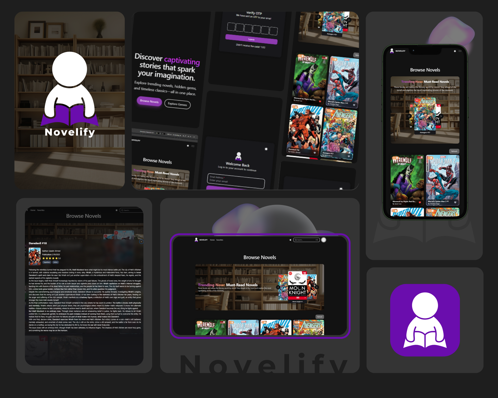

# Novelify



Novelify is a web application designed to enhance your reading experience by providing an intuitive and responsive interface for exploring and managing novels.

## Technologies Used

- [React.js](https://react.dev/)
- [Vite](https://vitejs.dev/guide/)
- [HeroUI](https://heroui.com)
- [Tailwind CSS](https://tailwindcss.com)
- [TypeScript](https://www.typescriptlang.org)
- [React Router](https://reactrouter.com/)

## Getting Started

### Clone the Repository

```bash
git clone https://github.com/your-username/novelify.git
cd novelify
```

### Install Dependencies

Using `npm`:

```bash
npm install
```

Alternatively, you can use `yarn`, `pnpm`, or `bun`.

### Run the Development Server

```bash
npm run dev
```

### Setup pnpm (optional)

If you are using `pnpm`, add the following to your `.npmrc` file:

```bash
public-hoist-pattern[]=*@heroui/*
```

Then reinstall dependencies:

```bash
pnpm install
```

## Features

- Browse and search for novels
- View novel details 
- Bookmark favorite novels
- Responsive UI

## License

<!-- This project is licensed under the [MIT license](https://github.com/your-username/novelify/blob/main/LICENSE). -->

